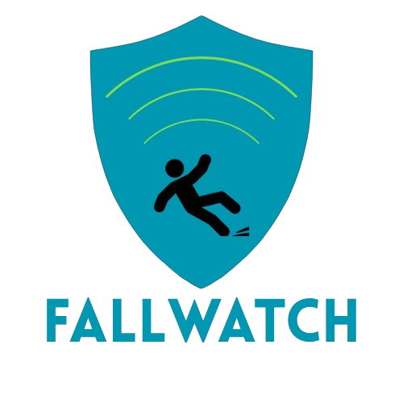

# Faceplant Forecast — FALLWATCH Radar Fall Detection System



**ECEN 403/404 | Team 20 | Texas A&M University | Fall 2025 – Spring 2026**

This repository contains the Raspberry Pi software stack (RaspberryPi/) and user application software stack (Application/) for the Faceplant Forecast Human Activity Detector. The FALLWATCH system uses a **TI AWR2944EVM millimeter-wave radar module** to continuously monitor a room, runs radar data through a custom-trained AI model to detect fall events, and automatically pushes notifications to a cloud backend when a fall is detected.

---

## Team Members

| Role | Name |
|---|---|
| Team Lead / Radar Subsystem | Fritz Hesse |
| AI & Power Subsystems | Charles Marks |
| App & Communication Subsystems | Henry Moyes |

---

## System Overview

The full FALLWATCH system consists of three hardware/software layers:

1. **TI AWR2944EVM** — millimeter-wave radar sensor connected to the Raspberry Pi over two USB-serial ports (a CLI/config port and a data port).
2. **Raspberry Pi 5** *(this repo)* — processes radar frames in real time, runs an AI inference model, and sends fall events to the cloud.
3. **Cloud Backend (GCP)** — receives WebSocket messages from the Pi and routes notifications to the companion mobile app.

---

## How It Works

On startup, `bootloader.py` creates two **shared memory buffers** (`cmd_buffer` and `radar_buffer`) that allow the three daemon processes to communicate without direct imports or coupling. The processes are then launched in a specific order:

1. **Server process** (`server.py`) — opens a WebSocket connection to the GCP backend and starts listening for remote commands.
2. **Command Port process** (`serial_connection/command_port.py`) — sends the radar configuration profile (`radar_profile.cfg`) to the AWR2944 over the CLI UART. Once configuration is confirmed, it signals readiness by setting `CMD_PORT_STATUS = ONLINE` in shared memory.
3. **Data Port process** (`serial_connection/data_port.py`) — waits for the command port to finish, then begins reading and parsing TI mmWave binary frames from the data UART. Parsed point-cloud data is passed through the AI model; if a fall is detected, the result is written to `radar_buffer`.

The bootloader then enters a **supervisor loop** that monitors the health of all three processes. Crashed processes are automatically restarted up to `PROCESS_MAX_RESTARTS` (3) times. If a process exceeds its restart budget, it is suspended and a notification is sent to the cloud. Suspended processes can be re-enabled remotely by sending a `restart_failed_daemons` command from the app.

---

## Repository Structure

```
RaspberryPi/
│
├── bootloader.py          # Entry point. Creates shared memory, launches and supervises all daemon processes.
├── server.py              # WebSocket client connecting to GCP. Sends fall events and system health events. Listens for app commands.
├── enums.py               # Shared integer enums used across all modules (buffer indices, status codes, commands, etc.)
├── live_visualizer.py     # Standalone dev tool: renders a live 3D point cloud and doppler-range plot from the radar UART.
├── radar_profile.cfg      # TI mmWave radar configuration profile (chirp parameters, frame rate, range/velocity settings).
├── test_process.py        # Integration test script for validating inter-process communication.
│
├── serial_connection/
│   ├── command_port.py    # Sends radar_profile.cfg to the AWR2944 CLI UART. Handles startup handshake and clean shutdown.
│   └── data_port.py       # Reads binary mmWave frames from the data UART. Parses TLV packets and feeds data to the AI model.
│
├── model/                 # AI model files (weights, inference code) for fall detection.
├── recordings/            # Stored radar frame recordings used for offline testing and model development.
├── dev_tools/             # Miscellaneous development utilities (data collection scripts, etc.).
├── old_models/            # Decommissioned model versions (archived 03-18-2026).
└── .vscode/               # VS Code workspace settings.
```

---

## Shared Memory Architecture

Rather than using sockets or pipes, inter-process communication is handled through **named shared memory segments** backed by NumPy arrays. This keeps latency low and avoids serialization overhead.

| Buffer | Name | Type | Purpose |
|---|---|---|---|
| `cmd_buffer` | `"cmd_buffer"` | `int8` × 9 | Carries system state flags and app commands. Indexed via `CMD_INDEX` enum. |
| `radar_buffer` | `"radar_buffer"` | `int64` × 4 | Carries the latest AI inference result. Indexed via `RADAR_DATA` enum. |

### Key `CMD_INDEX` fields

| Index | Field | Description |
|---|---|---|
| 0 | `MAIN_STATUS` | Overall system run state |
| 1 | `CMD_PORT_STATUS` | Whether the radar has been configured and is running |
| 2 | `AI_STATUS` | AI model state (offline, running, error, paused) |
| 5 | `FRAMERATE` | Target frame processing rate (default: 10 fps) |
| 6 | `APP_CMD` | Pending command from the app (e.g., `REDO_BACKGROUND_SCAN`) |
| 7 | `BOOT_MODE` | Launch mode (standard, demo visualizer, demo profiler, etc.) |
| 8 | `PLATFORM` | Detected platform (Raspberry Pi, dev laptop, dev desktop) |

### `RADAR_DATA` fields (written by AI, read by server)

| Index | Field | Description |
|---|---|---|
| 0 | `FALL_DETECTED` | Set to `1` when a fall is detected in the current frame |
| 1 | `FRAME_ID` | Frame number from the radar |
| 2 | `TIMESTAMP` | Unix timestamp of the fall event |
| 3 | `PROBABILITY` | Model confidence score (0–100, scaled by 100x from 0.0–1.0) |

---

## Cloud Communication

`server.py` connects to a GCP WebSocket endpoint (`wss://gcr-ws-...`) authenticated via a query-parameter token. All messages are JSON and follow a standard envelope format:

```json
{
  "msg_type": "fall_event",
  "ts_send": "03-19-2026 14:23:01",
  "device_id": "deployed-pi-01",
  "account_id": "account-1",
  "payload": { ... }
}
```

**Message types:**
- `fall_event` — fired when the AI detects a fall; includes `probability`, `frame_id`, and `ts_fall`.
- `system_event` — reports daemon health (process crashes, restart failures, startup status).
- `register` — sent on connection to identify the Pi to the backend.

The server also runs a persistent **command listener thread** that waits for incoming app commands. Supported commands:

| Command string | Effect |
|---|---|
| `redo_background_scan` | Sets `APP_CMD = REDO_BACKGROUND_SCAN` in shared memory |
| `restart_failed_daemons` / `retry_failed_daemons` | Clears restart counters and relaunches any suspended processes |

---

## Radar Hardware & Configuration

The **TI AWR2944EVM** communicates over two separate USB-serial ports:

- **CLI/Config port** — 115200 baud. Used to send the `.cfg` file line-by-line at startup.
- **Data port** — 3,125,000 baud. Streams binary TLV (Type-Length-Value) frames continuously once the radar is running.

> **Note on serial port naming:** The Raspberry Pi occasionally reassigns USB port names (e.g., `/dev/ttyUSB0` vs `/dev/ttyUSB1`) between reboots. The serial connection code accounts for multiple possible port names. The root cause has not yet been identified.

Parsed TLV data includes per-detected-object fields: `x`, `y`, `z` position (meters), Doppler velocity (m/s), SNR, and noise floor.

---

## Running the System

### Normal operation

```bash
python bootloader.py
```

The bootloader will configure the radar, start all daemons, and begin monitoring. Press `Ctrl+C` to stop cleanly — shared memory will be released and the radar will be shut down.

### Demo / development modes

```bash
# Live 3D point cloud visualizer (requires physical radar connected)
python bootloader.py --demo-visualizer

# Dropped frame profiler
python bootloader.py --demo-profiler

# WebSocket connection test (no radar required)
python bootloader.py --demo-connection
```

### Standalone live visualizer

The `live_visualizer.py` script can be run independently for radar visualization without the full system stack. It renders a live 3D point cloud and doppler-range plot filtered by SNR. Update the `CFG_PORT` and `DATA_PORT` constants at the top of the file to match your system.

```bash
python live_visualizer.py
```

---

## Dependencies

| Package | Purpose |
|---|---|
| `numpy` | Shared memory arrays and numerical processing |
| `pyserial` | UART communication with the AWR2944 |
| `websockets` | Async WebSocket client for GCP backend |
| `matplotlib` | Live point cloud visualization (`live_visualizer.py`) |

Install with:

```bash
pip install numpy pyserial websockets matplotlib
```